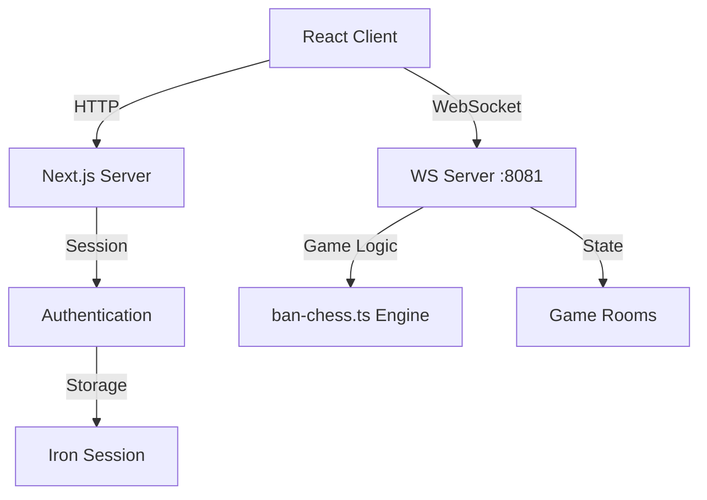
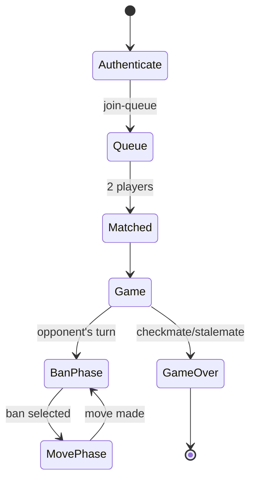

# 📚 2ban-2chess Project Documentation Index

## 🎯 Project Overview

**2ban-2chess** is a real-time multiplayer chess variant platform implementing "Ban Chess" - a strategic twist on traditional chess where players can ban opponent moves before each turn.

### Key Features
- 🎮 Real-time multiplayer gameplay via WebSocket
- 🔐 User authentication with iron-session
- 🎵 Sound effects and audio feedback
- 📱 Responsive UI with Tailwind CSS
- ♟️ Full ban-chess rule implementation
- 🔄 Real-time game state synchronization

## 🏗️ Architecture Overview

### Technology Stack
| Layer | Technology | Purpose |
|-------|------------|---------|
| Frontend | Next.js 14 (App Router) | React framework with SSR |
| UI Components | react-chessground | Interactive chess board |
| Styling | Tailwind CSS v4 | Utility-first CSS |
| Game Logic | ban-chess.ts | Chess variant engine |
| Real-time | WebSocket (ws) | Bidirectional communication |
| Authentication | iron-session | Secure session management |
| Runtime | Node.js + TypeScript | Type-safe backend |

### System Architecture



## 📁 Project Structure

### Core Directories

#### `/app` - Next.js App Router
| Path | Description | Key Files |
|------|-------------|-----------|
| `/api/auth/*` | Authentication endpoints | login, logout, session routes |
| `/game/[id]` | Dynamic game pages | Real-time game interface |
| `/` | Root layout & homepage | Main entry point |

#### `/components` - React Components
| Component | Purpose | Dependencies |
|-----------|---------|--------------|
| `ChessBoard.tsx` | Chess board wrapper | react-chessground |
| `SoundControl.tsx` | Audio management UI | Howler.js |
| `UserInfo.tsx` | User session display | AuthContext |
| `UsernameOverlay.tsx` | Username input modal | Authentication flow |

#### `/lib` - Core Libraries
| Module | Purpose | Exports |
|--------|---------|---------|
| `game-types.ts` | TypeScript types | Move, Ban, Messages |
| `ws-client.ts` | WebSocket client | Connection management |
| `sound-manager.ts` | Audio controller | Sound effects system |
| `session.ts` | Session config | Iron-session setup |
| `performance-monitor.ts` | Performance tracking | Metrics collection |

#### `/server` - Backend Services
| Service | Port | Protocol | Purpose |
|---------|------|----------|---------|
| `ws-server.ts` | 8081 | WebSocket | Game state management |

## 🔌 API Documentation

### REST Endpoints

#### Authentication API

##### POST `/api/auth/login`
Authenticate user and create session.

**Request Body:**
```typescript
{
  username: string; // 2-20 alphanumeric characters
}
```

**Response:**
```typescript
{
  success: boolean;
  user?: { id: string; username: string };
  error?: string;
}
```

##### POST `/api/auth/logout`
Destroy current session.

**Response:**
```typescript
{
  success: boolean;
}
```

##### GET `/api/auth/session`
Retrieve current session data.

**Response:**
```typescript
{
  user?: { id: string; username: string };
}
```

### WebSocket Protocol

#### Connection
```
ws://localhost:8081
```

#### Message Types

##### Client → Server Messages

```typescript
type ClientMsg =
  | { type: 'authenticate'; userId: string; username: string }
  | { type: 'join-queue' }
  | { type: 'leave-queue' }
  | { type: 'join-game'; gameId: string }
  | { type: 'ban'; gameId: string; ban: Ban }
  | { type: 'move'; gameId: string; move: Move };
```

##### Server → Client Messages

```typescript
type ServerMsg =
  | {
      type: 'state';
      fen: string;              // Board position in FEN notation
      pgn: string;              // Game history in PGN format
      nextAction: 'ban' | 'move';
      legalMoves?: Move[];      // Available moves (if player's turn)
      legalBans?: Ban[];        // Available bans (if banning phase)
      history?: HistoryEntry[]; // Complete game history
      turn: 'white' | 'black';
      gameId: string;
      players?: { white?: string; black?: string };
    }
  | { type: 'error'; message: string; error?: string }
  | { type: 'authenticated'; userId: string; username: string }
  | { type: 'queued'; position: number }
  | { type: 'matched'; gameId: string; color: 'white' | 'black'; opponent?: string }
  | { type: 'joined'; gameId: string; color: 'white' | 'black'; players?: object };
```

## 🎮 Game Flow

### State Machine



### Turn Sequence
1. **Ban Phase**: Current player selects one opponent move to ban
2. **Move Phase**: Opponent makes a legal move (excluding banned move)
3. **State Update**: Board updates, turn switches
4. **Repeat**: Continue until game ends

## 🔊 Sound System

### Audio Events
| Event | Sound File | Trigger |
|-------|------------|---------|
| Move | `move.wav` | Player moves piece |
| Opponent Move | `opponent-move.wav` | Opponent moves |
| Capture | `capture.wav` | Piece captured |
| Check | `check.wav` | King in check |
| Castle | `castle.wav` | Castling move |
| Promote | `promote.wav` | Pawn promotion |
| Ban | `ban.wav` | Move banned |
| Game Start | `game-start.wav` | Match begins |
| Game End | `game-end.wav` | Checkmate/stalemate |

## 🛠️ Development

### Commands

#### Recommended Development Workflow
```bash
# Terminal 1: WebSocket server with isolated logs
npm run dev:ws        # Start WebSocket server with hot reload

# Terminal 2: Next.js server with isolated logs  
npm run dev:next      # Start Next.js development server

# Alternative: Combined (less optimal for log analysis)
npm run dev           # Start both servers concurrently
```

#### Build & Production
```bash
npm run build         # Production build
npm run start         # Start production server
npm run ws-server     # Production WebSocket server
```

#### Code Quality
```bash
npm run type-check    # TypeScript validation
npm run lint          # ESLint checks
npm run lint:fix      # Auto-fix linting issues
npm run analyze       # Run all checks
```

### Environment Setup

No environment variables required for basic setup. Uses:
- Next.js: Port 3000
- WebSocket: Port 8081

### Dependencies

#### Core Dependencies
- `next@14.2.18` - React framework
- `react@18` - UI library
- `ban-chess.ts@1.1.3` - Game engine
- `react-chessground@1.5.0` - Chess board UI
- `ws@8.18.0` - WebSocket server
- `iron-session@8.0.4` - Session management
- `howler@2.2.4` - Audio library

## 🔒 Security Features

### Authentication
- Session-based authentication via iron-session
- Secure cookie storage
- Username validation (2-20 alphanumeric)

### Game Security
- Server-side move validation
- WebSocket message authentication
- Player identity verification
- Game room isolation

## 📊 Performance Optimizations

### Features Implemented
- React Server Components for reduced bundle size
- WebSocket connection pooling
- Lazy loading of game components
- Sound preloading and caching
- Efficient board state updates

### Monitoring
- Custom performance monitor (`performance-monitor.ts`)
- WebSocket connection health checks
- Error tracking and recovery

## 🚀 Deployment Considerations

### Production Checklist
- [ ] Configure production WebSocket URL
- [ ] Set up SSL/TLS for WebSocket
- [ ] Configure session secrets
- [ ] Set up monitoring and logging
- [ ] Implement rate limiting
- [ ] Add error tracking (e.g., Sentry)
- [ ] Configure CDN for assets
- [ ] Set up database for game persistence

### Scaling Considerations
- WebSocket server horizontal scaling
- Redis for session storage
- Database for game history
- Load balancing configuration
- CDN for static assets

## 📝 Testing Strategy

### Test Coverage Areas
- Unit tests for game logic
- Component testing for UI
- E2E tests for game flows
- WebSocket connection tests
- Authentication flow tests

### Testing Commands
```bash
npm run test        # Run test suite
npm run test:watch  # Watch mode
npm run test:e2e    # E2E tests
```

## 🔄 Future Enhancements

### Planned Features
- [ ] Persistent game storage
- [ ] User profiles and statistics  
- [ ] Tournament system
- [ ] Spectator mode
- [ ] Game analysis tools
- [ ] Mobile app versions
- [ ] AI opponents
- [ ] Time controls
- [ ] ELO rating system

## 📚 Related Documentation

### External Resources
- [ban-chess.ts Documentation](https://github.com/bezalel6/ban-chess.ts)
- [react-chessground API](https://github.com/ruilisi/react-chessground)
- [Next.js 14 Documentation](https://nextjs.org/docs)
- [WebSocket Protocol RFC](https://tools.ietf.org/html/rfc6455)

### Internal Docs
- [`CLAUDE.md`](./CLAUDE.md) - AI assistant configuration
- [`README.md`](./README.md) - Quick start guide
- [`package.json`](./package.json) - Dependencies & scripts

## 🤝 Contributing

### Development Workflow
1. Create feature branch
2. Implement changes with tests
3. Run `npm run analyze`
4. Submit pull request
5. Code review process
6. Merge to main

### Code Standards
- TypeScript strict mode
- ESLint configuration
- Prettier formatting
- Conventional commits
- Component-based architecture

---

*Last Updated: 2025-08-26*  
*Version: 0.1.0*