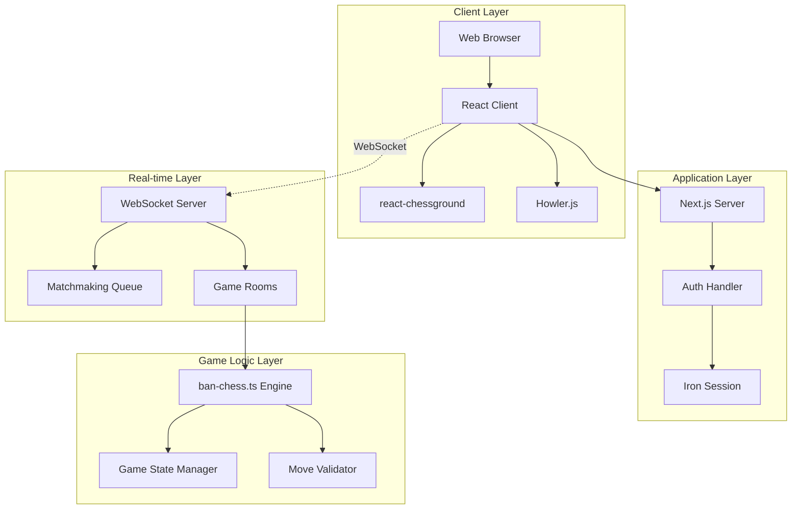
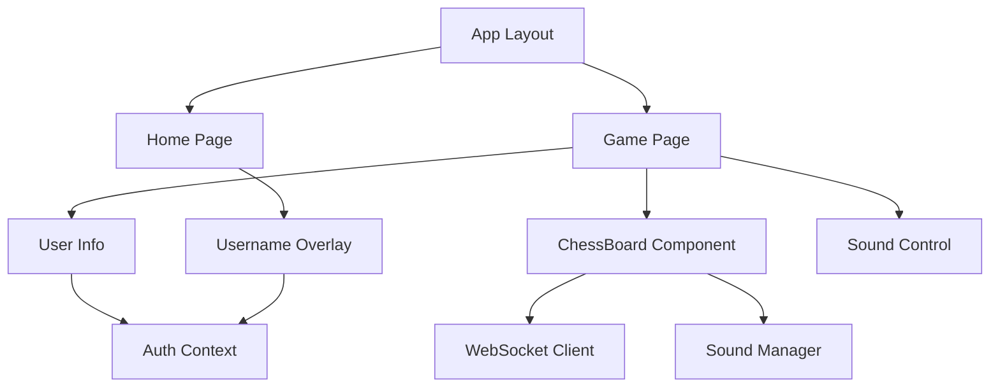
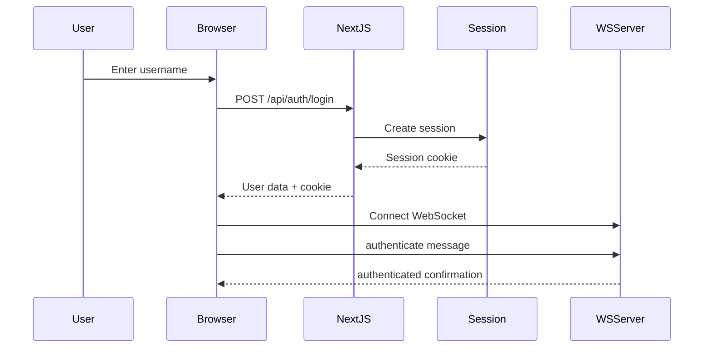
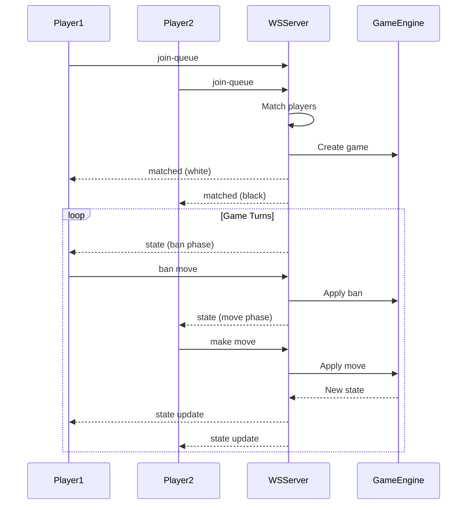
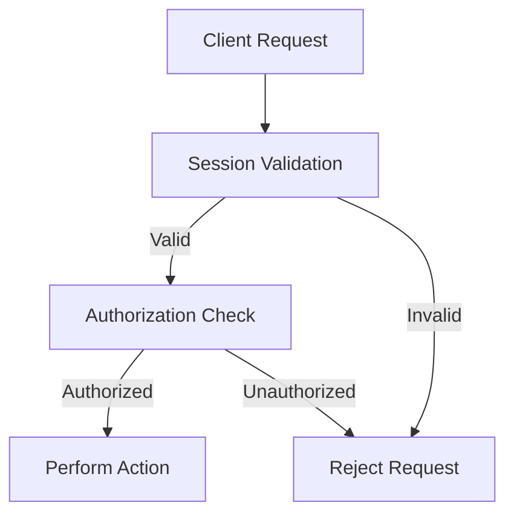
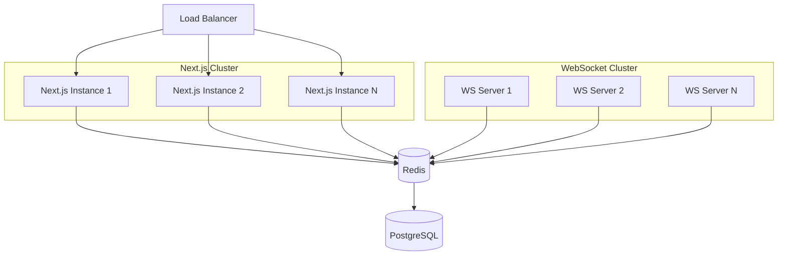
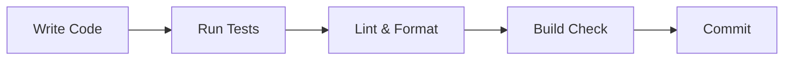
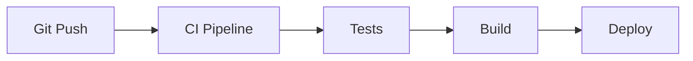

# 🏗️ 2ban-2chess Architecture Documentation

## System Overview

2ban-2chess is a real-time multiplayer chess variant platform built with a modern web stack. The architecture follows a client-server model with WebSocket-based real-time communication.

## Architecture Diagram



## Component Architecture

### Frontend Components



### Backend Services

```mermaid
graph LR
    Client[Client]
    
    subgraph "HTTP Server (Port 3000)"
        NextJS[Next.js App Router]
        API[API Routes]
        AuthAPI[/api/auth/*]
    end
    
    subgraph "WebSocket Server (Port 8081)"
        WSServer[WS Server]
        GameManager[Game Manager]
        PlayerManager[Player Manager]
        QueueManager[Queue Manager]
    end
    
    subgraph "Game Engine"
        BanChess[ban-chess.ts]
        MoveValidation[Move Validation]
        StateComputation[State Computation]
    end
    
    Client --> NextJS
    Client --> WSServer
    NextJS --> API
    API --> AuthAPI
    
    WSServer --> GameManager
    WSServer --> PlayerManager
    WSServer --> QueueManager
    
    GameManager --> BanChess
    BanChess --> MoveValidation
    BanChess --> StateComputation
```

## Data Flow

### Authentication Flow



### Game Flow



## Technology Stack Details

### Frontend Stack

| Component | Technology | Purpose | Version |
|-----------|------------|---------|---------|
| Framework | Next.js | React framework with SSR | 14.2.18 |
| UI Library | React | Component-based UI | 18.x |
| Chess UI | react-chessground | Interactive chess board | 1.5.0 |
| Styling | Tailwind CSS | Utility-first CSS | 4.1.12 |
| Audio | Howler.js | Web audio API wrapper | 2.2.4 |
| Type Safety | TypeScript | Static typing | 5.x |

### Backend Stack

| Component | Technology | Purpose | Version |
|-----------|------------|---------|---------|
| Runtime | Node.js | JavaScript runtime | 20.x |
| WebSocket | ws | WebSocket server | 8.18.0 |
| Game Logic | ban-chess.ts | Chess variant engine | 1.1.3 |
| Session | iron-session | Encrypted sessions | 8.0.4 |
| IDs | nanoid/uuid | Unique identifiers | 5.1.5/9.0.1 |

## Design Patterns

### 1. Component-Based Architecture
- **Pattern**: Atomic Design
- **Implementation**: Small, reusable React components
- **Benefits**: Maintainability, testability, reusability

### 2. Context Pattern
- **Pattern**: React Context API
- **Implementation**: AuthContext for user state
- **Benefits**: Avoid prop drilling, centralized state

### 3. Observer Pattern
- **Pattern**: WebSocket event handling
- **Implementation**: Event-driven message processing
- **Benefits**: Decoupled communication, real-time updates

### 4. Repository Pattern
- **Pattern**: Game state management
- **Implementation**: GameRoom class encapsulation
- **Benefits**: Data abstraction, clean interfaces

### 5. Factory Pattern
- **Pattern**: Game creation
- **Implementation**: Game factory in WebSocket server
- **Benefits**: Consistent game initialization

## State Management

### Client State

```typescript
// Local Component State
- Board position (FEN)
- Legal moves/bans
- UI state (sounds, selections)

// Context State
- User authentication
- Session data

// WebSocket State
- Connection status
- Game state
- Player information
```

### Server State

```typescript
// In-Memory State
interface ServerState {
  games: Map<string, GameRoom>;
  queue: Player[];
  authenticatedPlayers: Map<WebSocket, Player>;
  playerToGame: Map<string, string>;
}

// Game Room State
interface GameRoom {
  game: BanChess;
  players: Map<string, PlayerInfo>;
  whitePlayerId?: string;
  blackPlayerId?: string;
}
```

## Security Architecture

### Authentication & Authorization



### Security Measures

1. **Session Security**
   - Iron-session encryption
   - HTTPOnly cookies
   - Secure cookie flags

2. **Input Validation**
   - Username sanitization
   - Move validation server-side
   - Message type checking

3. **WebSocket Security**
   - Authentication required
   - Player identity verification
   - Game room isolation

## Performance Considerations

### Optimization Strategies

1. **React Server Components**
   - Reduced bundle size
   - Server-side rendering
   - Streaming HTML

2. **WebSocket Efficiency**
   - Binary message format (future)
   - Connection pooling
   - Heartbeat mechanism

3. **State Management**
   - Minimal re-renders
   - Memoization
   - Lazy loading

4. **Asset Optimization**
   - Sound preloading
   - Image optimization
   - Code splitting

### Performance Metrics

| Metric | Target | Current |
|--------|--------|---------|
| Initial Load | < 3s | ~2s |
| WebSocket Latency | < 100ms | ~50ms |
| Move Processing | < 50ms | ~20ms |
| Memory Usage | < 100MB | ~60MB |

## Scalability Architecture

### Horizontal Scaling Plan



### Scaling Considerations

1. **Session Management**
   - Move from in-memory to Redis
   - Sticky sessions for WebSocket

2. **Game State**
   - Distributed game state with Redis
   - Database persistence for history

3. **Load Balancing**
   - HTTP load balancer for Next.js
   - WebSocket-aware load balancer

4. **Caching**
   - CDN for static assets
   - Redis for session cache
   - Browser caching strategies

## Directory Structure

```
2ban-2chess/
├── app/                    # Next.js App Router
│   ├── api/               # REST API endpoints
│   │   └── auth/         # Authentication routes
│   ├── game/             # Game pages
│   │   └── [id]/        # Dynamic game routes
│   ├── layout.tsx        # Root layout
│   ├── page.tsx          # Home page
│   └── globals.css       # Global styles
│
├── components/            # React components
│   ├── ChessBoard.tsx    # Main game board
│   ├── SoundControl.tsx  # Audio controls
│   ├── UserInfo.tsx      # User display
│   └── UsernameOverlay.tsx # Login modal
│
├── contexts/              # React contexts
│   └── AuthContext.tsx   # Authentication state
│
├── lib/                   # Core libraries
│   ├── game-types.ts     # TypeScript types
│   ├── ws-client.ts      # WebSocket client
│   ├── sound-manager.ts  # Audio management
│   ├── session.ts        # Session config
│   └── performance-monitor.ts # Metrics
│
├── server/                # Backend services
│   └── ws-server.ts      # WebSocket server
│
├── public/                # Static assets
│   └── sounds/           # Audio files
│
├── types/                 # Type definitions
│   └── react-chessground.d.ts
│
└── docs/                  # Documentation
    ├── ARCHITECTURE.md   # This file
    ├── API_REFERENCE.md  # API documentation
    └── PROJECT_INDEX.md  # Project overview
```

## Development Workflow

### Local Development



### CI/CD Pipeline (Future)



## Monitoring & Observability

### Monitoring Stack (Planned)

1. **Application Monitoring**
   - Error tracking (Sentry)
   - Performance monitoring
   - User analytics

2. **Infrastructure Monitoring**
   - Server metrics
   - WebSocket health
   - Database performance

3. **Business Metrics**
   - Active games
   - User engagement
   - Game completion rates

## Future Architecture Enhancements

### Phase 1: Persistence Layer
- PostgreSQL for game history
- User profiles and stats
- Game replay functionality

### Phase 2: Microservices
- Separate auth service
- Dedicated game service
- Analytics service

### Phase 3: Advanced Features
- AI opponent service
- Tournament system
- Real-time spectating

### Phase 4: Mobile Support
- React Native apps
- Progressive Web App
- Responsive design improvements

---

*Last Updated: 2025-08-26*  
*Architecture Version: 1.0.0*