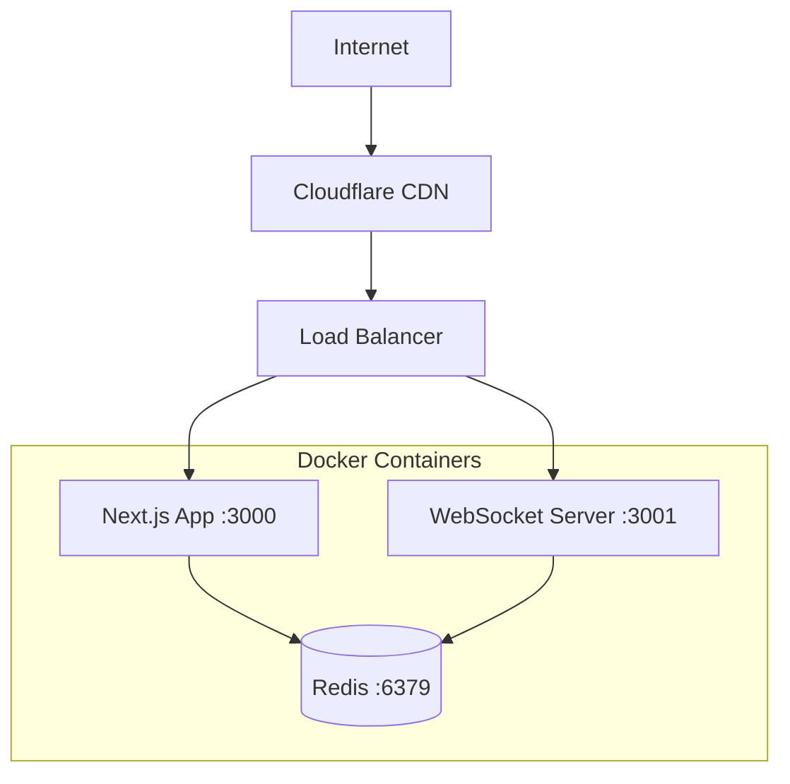

# 2ban-2chess Production Deployment Guide

A comprehensive guide for deploying the 2ban-2chess application to production environments.

## Table of Contents

1. [Overview](#overview)
2. [Production Architecture](#production-architecture)
3. [Docker Configuration](#docker-configuration)
4. [Coolify Deployment](#coolify-deployment)
5. [GitHub Actions CI/CD](#github-actions-cicd)
6. [DNS & Domain Setup](#dns--domain-setup)
7. [Environment Variables](#environment-variables)
8. [SSL/TLS Configuration](#ssltls-configuration)
9. [Monitoring & Health Checks](#monitoring--health-checks)
10. [Troubleshooting](#troubleshooting)
11. [Rollback Procedures](#rollback-procedures)

## Overview

The 2ban-2chess application runs as a multi-container setup with:
- **Next.js App Server** (port 3000) - Main application
- **WebSocket Server** (port 3001) - Real-time game communication
- **Redis** (port 6379) - Session storage and game state persistence

## Production Architecture



## Docker Configuration

### Production Dockerfiles

#### 1. Next.js Application (`Dockerfile.standalone`)

**⚠️ Critical**: Always use `Dockerfile.standalone` for production to avoid routing issues.

```dockerfile
# Multi-stage build for optimized production image
FROM node:20-alpine AS deps
WORKDIR /app
COPY package*.json ./
RUN npm ci --only=production && npm cache clean --force

FROM node:20-alpine AS builder
WORKDIR /app
COPY package*.json ./
RUN npm ci
COPY . .
ENV NEXT_TELEMETRY_DISABLED=1
RUN npm run build

FROM node:20-alpine AS runner
WORKDIR /app
ENV NODE_ENV=production
ENV NEXT_TELEMETRY_DISABLED=1

RUN addgroup -g 1001 -S nodejs
RUN adduser -S nextjs -u 1001

# Copy production files
COPY --from=deps /app/node_modules ./node_modules
COPY --from=builder --chown=nextjs:nodejs /app/.next/standalone ./
COPY --from=builder --chown=nextjs:nodejs /app/.next/static ./.next/static
COPY --from=builder --chown=nextjs:nodejs /app/public ./public

USER nextjs
EXPOSE 3000

CMD ["node", "server.js"]
```

#### 2. WebSocket Server (`Dockerfile.websocket`)

```dockerfile
FROM node:20-alpine AS runner
WORKDIR /app

# Copy package files
COPY package*.json ./
RUN npm ci --only=production && npm cache clean --force

# Copy WebSocket server files
COPY server/ ./server/
COPY lib/ ./lib/
COPY types/ ./types/

EXPOSE 3001

CMD ["node", "server/ws-server.js"]
```

#### 3. Docker Compose (`docker-compose.coolify.yml`)

```yaml
version: '3.8'

services:
  app:
    build:
      context: .
      dockerfile: Dockerfile.standalone
    ports:
      - "3000:3000"
    environment:
      - NODE_ENV=production
      - NEXTAUTH_URL=${NEXTAUTH_URL}
      - NEXTAUTH_SECRET=${NEXTAUTH_SECRET}
      - NEXT_PUBLIC_WEBSOCKET_URL=${NEXT_PUBLIC_WEBSOCKET_URL}
      - REDIS_URL=redis://redis:6379
    depends_on:
      - redis
    restart: unless-stopped
    healthcheck:
      test: ["CMD", "curl", "-f", "http://localhost:3000/api/health"]
      interval: 30s
      timeout: 10s
      retries: 3

  websocket:
    build:
      context: .
      dockerfile: Dockerfile.websocket
    ports:
      - "3001:3001"
    environment:
      - NODE_ENV=production
      - REDIS_URL=redis://redis:6379
    depends_on:
      - redis
    restart: unless-stopped
    healthcheck:
      test: ["CMD", "nc", "-z", "localhost", "3001"]
      interval: 30s
      timeout: 10s
      retries: 3

  redis:
    image: redis:7-alpine
    command: redis-server --appendonly yes --maxmemory 256mb --maxmemory-policy allkeys-lru
    volumes:
      - redis-data:/data
    restart: unless-stopped
    healthcheck:
      test: ["CMD", "redis-cli", "ping"]
      interval: 10s
      timeout: 5s
      retries: 3

volumes:
  redis-data:
```

## Coolify Deployment

### Quick Setup Process

1. **Create Application in Coolify**
   - Source: Docker Compose
   - Repository: Point to your GitHub repo
   - Docker Compose file: `docker-compose.coolify.yml`

2. **Configure Domains**
   - App service: `chess.yourdomain.com`
   - WebSocket service: `ws-chess.yourdomain.com`

3. **Set Environment Variables** (see [Environment Variables](#environment-variables))

4. **Deploy**
   - Coolify will automatically build and deploy all services
   - SSL certificates are handled automatically

### Manual Deployment Commands

```bash
# Build production images locally
npm run build
npm run build:ws

# Test production build locally
npm run start:production

# Deploy to Coolify (using provided scripts)
./deploy-to-coolify.ps1 -Trigger

# Deploy without rebuilding
./deploy-to-coolify.ps1 -SkipBuild
```

### Coolify API Setup for Automation

#### 1. Generate API Token
1. Go to Coolify Dashboard → Settings → API Tokens
2. Create token with "Deploy Application" permission
3. Copy token immediately (not shown again)

#### 2. Configure Environment Variables

**Option A: PowerShell Environment Variables**
```powershell
$env:COOLIFY_API_TOKEN = "your-token-here"
$env:COOLIFY_URL = "https://coolify.yourdomain.com"
```

**Option B: Create `.env.deploy.local`**
```env
COOLIFY_API_TOKEN=your-token-here
COOLIFY_URL=https://coolify.yourdomain.com
COOLIFY_APP_ID=your-app-id
```

## GitHub Actions CI/CD

### Automated Deployment Pipeline

The repository includes GitHub Actions for automated deployments:

```yaml
# .github/workflows/deploy.yml
name: Build and Deploy to Coolify

on:
  push:
    branches: [ main, master ]
  workflow_dispatch:
    inputs:
      trigger_coolify:
        description: 'Trigger Coolify deployment after build'
        required: false
        default: 'true'
        type: boolean

jobs:
  build-and-push:
    runs-on: ubuntu-latest
    steps:
      - uses: actions/checkout@v4
      
      - name: Set up Docker Buildx
        uses: docker/setup-buildx-action@v3
      
      - name: Login to GitHub Container Registry
        uses: docker/login-action@v3
        with:
          registry: ghcr.io
          username: ${{ github.actor }}
          password: ${{ secrets.GITHUB_TOKEN }}
      
      - name: Build and push Docker images
        uses: docker/build-push-action@v5
        with:
          context: .
          file: ./Dockerfile.standalone
          push: true
          tags: ghcr.io/${{ github.repository }}:${{ github.sha }},ghcr.io/${{ github.repository }}:latest
          cache-from: type=gha
          cache-to: type=gha,mode=max
      
      - name: Trigger Coolify Deployment
        if: inputs.trigger_coolify == 'true' || github.event_name == 'push'
        run: |
          curl -X POST \
            -H "Authorization: Bearer ${{ secrets.COOLIFY_API_TOKEN }}" \
            -H "Content-Type: application/json" \
            "${{ secrets.COOLIFY_URL }}/api/v1/applications/${{ secrets.COOLIFY_APP_ID }}/restart"
```

### Required GitHub Secrets

Add these secrets in GitHub Settings → Secrets → Actions:

| Secret | Description | Example |
|--------|-------------|---------|
| `COOLIFY_API_TOKEN` | Coolify API token | `clfy_xxxxxxxxxxxx` |
| `COOLIFY_URL` | Coolify instance URL | `https://coolify.example.com` |
| `COOLIFY_APP_ID` | Application ID in Coolify | `app-123456789` |
| `NEXTAUTH_SECRET` | NextAuth secret for production | `your-secure-secret` |

## DNS & Domain Setup

### Recommended Setup with Cloudflare

#### DNS Records (Cloudflare Tunnel)

| Subdomain | Type | Target | Proxy Status | Purpose |
|-----------|------|--------|--------------|---------|
| `chess` | CNAME | `your-tunnel-id.cfargotunnel.com` | 🟠 Proxied | Main app |
| `ws-chess` | CNAME | `your-tunnel-id.cfargotunnel.com` | 🟠 Proxied | WebSocket |

#### Cloudflare Tunnel Configuration

Configure these services in your Cloudflare Tunnel:

```yaml
# cloudflared tunnel configuration
tunnel: your-tunnel-id
credentials-file: /path/to/credentials.json

ingress:
  - hostname: chess.yourdomain.com
    service: http://localhost:3000
  - hostname: ws-chess.yourdomain.com
    service: http://localhost:3001
  - service: http_status:404
```

### Alternative: Direct DNS (without Cloudflare Tunnel)

| Subdomain | Type | Target | Purpose |
|-----------|------|--------|---------|
| `chess` | A | `your.server.ip.address` | Main app |
| `ws-chess` | A | `your.server.ip.address` | WebSocket |

## Environment Variables

### Required Production Variables

```bash
# Application URLs
NEXTAUTH_URL=https://chess.yourdomain.com
NEXT_PUBLIC_WEBSOCKET_URL=wss://ws-chess.yourdomain.com

# Security
NEXTAUTH_SECRET=your-secure-random-secret-here
NODE_ENV=production

# Database/Storage  
REDIS_URL=redis://redis:6379

# Optional: OAuth Providers
GOOGLE_CLIENT_ID=your-google-client-id
GOOGLE_CLIENT_SECRET=your-google-client-secret
LICHESS_CLIENT_ID=your-lichess-client-id

# Deployment
GITHUB_REPOSITORY=yourusername/2ban-2chess
```

### Setting Variables in Coolify

1. Go to your application in Coolify
2. Navigate to "Environment Variables"
3. Add each variable with its production value
4. Redeploy the application

### Variable Validation

The application includes runtime checks for required variables:

```typescript
// Validates all required environment variables on startup
const requiredVars = [
  'NEXTAUTH_URL',
  'NEXTAUTH_SECRET',
  'NEXT_PUBLIC_WEBSOCKET_URL'
];

requiredVars.forEach(varName => {
  if (!process.env[varName]) {
    throw new Error(`Missing required environment variable: ${varName}`);
  }
});
```

## SSL/TLS Configuration

### Automatic SSL (Recommended)

When using Coolify with domain configuration:
- SSL certificates are automatically generated via Let's Encrypt
- Automatic renewal every 90 days
- HTTPS redirect enabled by default

### Manual SSL Configuration

If managing SSL manually:

```nginx
# Nginx configuration
server {
    listen 443 ssl http2;
    server_name chess.yourdomain.com;
    
    ssl_certificate /path/to/certificate.crt;
    ssl_certificate_key /path/to/private.key;
    
    location / {
        proxy_pass http://localhost:3000;
        proxy_http_version 1.1;
        proxy_set_header Upgrade $http_upgrade;
        proxy_set_header Connection 'upgrade';
        proxy_set_header Host $host;
        proxy_set_header X-Real-IP $remote_addr;
        proxy_set_header X-Forwarded-For $proxy_add_x_forwarded_for;
        proxy_set_header X-Forwarded-Proto $scheme;
    }
}

server {
    listen 443 ssl http2;
    server_name ws-chess.yourdomain.com;
    
    ssl_certificate /path/to/certificate.crt;
    ssl_certificate_key /path/to/private.key;
    
    location / {
        proxy_pass http://localhost:3001;
        proxy_http_version 1.1;
        proxy_set_header Upgrade $http_upgrade;
        proxy_set_header Connection "upgrade";
        proxy_set_header Host $host;
    }
}
```

## Monitoring & Health Checks

### Application Health Endpoints

- **App Health**: `https://chess.yourdomain.com/api/health`
- **WebSocket Health**: Connect to `wss://ws-chess.yourdomain.com`

### Health Check Responses

```json
// GET /api/health (200 OK)
{
  "status": "ok",
  "timestamp": "2024-01-01T00:00:00.000Z",
  "services": {
    "database": "connected",
    "redis": "connected"
  }
}
```

### Docker Health Checks

Built-in container health monitoring:

```yaml
# Health check configuration in docker-compose.yml
healthcheck:
  test: ["CMD", "curl", "-f", "http://localhost:3000/api/health"]
  interval: 30s
  timeout: 10s
  retries: 3
  start_period: 40s
```

### Monitoring Stack (Optional)

For advanced monitoring, consider integrating:

- **Prometheus** - Metrics collection
- **Grafana** - Visualization dashboards  
- **Loki** - Log aggregation
- **Uptime Kuma** - Simple uptime monitoring

## Troubleshooting

### Common Issues

#### 1. 404 Errors on All Routes
**Cause**: Using wrong Dockerfile or startup command
**Solution**: Ensure using `Dockerfile.standalone` and `CMD ["node", "server.js"]`

#### 2. WebSocket Connection Failed
**Symptoms**: Players can't connect, real-time features don't work
**Solutions**:
- Verify `NEXT_PUBLIC_WEBSOCKET_URL` is correctly set
- Check WebSocket server is running on port 3001
- Ensure firewall allows WebSocket connections
- Test connection: `curl -I wss://ws-chess.yourdomain.com`

#### 3. Authentication Not Working
**Symptoms**: Users can't log in, sessions not persisting
**Solutions**:
- Verify `NEXTAUTH_SECRET` is set in production
- Check `NEXTAUTH_URL` matches your domain exactly
- Ensure Redis is running and accessible
- Check OAuth provider configuration

#### 4. Redis Connection Issues
**Symptoms**: Session loss, game state not persisting
**Solutions**:
- Verify Redis container is running: `docker ps`
- Check Redis logs: `docker logs <redis-container-id>`
- Test Redis connection: `redis-cli -h redis ping`
- Verify `REDIS_URL` environment variable

#### 5. Build Failures
**Common causes and solutions**:
- **Node version mismatch**: Ensure using Node 20+
- **Package-lock.json conflicts**: Delete and regenerate
- **TypeScript errors**: Run `npm run type-check`
- **Missing dependencies**: Run `npm ci`

### Deployment Verification Script

```bash
#!/bin/bash
# verify-deployment.sh

echo "🔍 Verifying 2ban-2chess deployment..."

# Test main app
echo "Testing main application..."
curl -f "https://chess.yourdomain.com/api/health" || echo "❌ Main app health check failed"

# Test WebSocket connection  
echo "Testing WebSocket connection..."
curl -f -H "Connection: Upgrade" -H "Upgrade: websocket" "https://ws-chess.yourdomain.com/" || echo "❌ WebSocket connection failed"

# Test Redis connectivity (if accessible)
echo "Testing Redis..."
docker exec redis redis-cli ping || echo "❌ Redis not responding"

# Test SSL certificates
echo "Testing SSL certificates..."
curl -I "https://chess.yourdomain.com" | grep "HTTP/2 200" || echo "❌ SSL/HTTP2 issue"

echo "✅ Deployment verification complete"
```

### Debug Commands

```bash
# View application logs
docker logs <app-container-id> -f

# View WebSocket logs  
docker logs <websocket-container-id> -f

# Check Redis data
docker exec -it <redis-container-id> redis-cli
> KEYS *
> GET session:*

# Test network connectivity
docker exec <app-container-id> nc -zv redis 6379

# Monitor resource usage
docker stats

# Check container health
docker ps --format "table {{.Names}}\t{{.Status}}\t{{.Ports}}"
```

## Rollback Procedures

### Quick Rollback (Coolify)

1. **Via Coolify Dashboard**:
   - Go to Application → Deployments
   - Find previous successful deployment
   - Click "Rollback"

2. **Via API**:
   ```bash
   curl -X POST \
     -H "Authorization: Bearer $COOLIFY_API_TOKEN" \
     "$COOLIFY_URL/api/v1/applications/$APP_ID/rollback/$DEPLOYMENT_ID"
   ```

### Git-based Rollback

```bash
# Revert to previous commit
git revert HEAD --no-edit
git push origin main

# Or reset to specific commit (destructive)
git reset --hard <previous-commit-hash>
git push origin main --force

# GitHub Actions will automatically redeploy
```

### Database Rollback (Redis)

Redis data is persistent but can be reset if needed:

```bash
# Backup current Redis data
docker exec redis redis-cli BGSAVE

# Clear all data (careful!)
docker exec redis redis-cli FLUSHALL

# Or restore from backup
docker cp backup.rdb redis:/data/dump.rdb
docker restart redis
```

### Emergency Procedures

#### Complete Service Restart

```bash
# Stop all services
docker-compose down

# Remove containers and volumes (data loss!)
docker-compose down -v

# Rebuild and restart
docker-compose up -d --build
```

#### Roll back to last known good state

1. **Identify last working commit**:
   ```bash
   git log --oneline -10
   ```

2. **Create hotfix branch**:
   ```bash
   git checkout -b hotfix/rollback-deployment
   git reset --hard <last-good-commit>
   git push origin hotfix/rollback-deployment
   ```

3. **Deploy hotfix**:
   - Update Coolify to deploy from hotfix branch
   - Or trigger manual deployment

4. **Create fix and merge back**:
   ```bash
   # After fixing the issue
   git checkout main
   git merge hotfix/rollback-deployment
   git push origin main
   ```

---

## Security Checklist

Before deploying to production:

- [ ] All environment variables secured (no hardcoded secrets)
- [ ] HTTPS enabled with valid SSL certificates
- [ ] `NEXTAUTH_SECRET` is cryptographically secure
- [ ] Redis password configured (if exposed)
- [ ] Firewall configured to allow only necessary ports
- [ ] Domain ownership verified
- [ ] OAuth redirect URLs updated for production
- [ ] CORS settings configured correctly
- [ ] Security headers implemented
- [ ] Rate limiting configured
- [ ] Log rotation configured
- [ ] Backup procedures in place
- [ ] Monitoring and alerting configured

## Support

- **GitHub Issues**: [Repository Issues](https://github.com/yourusername/2ban-2chess/issues)
- **Coolify Docs**: [https://coolify.io/docs](https://coolify.io/docs)
- **Next.js Deployment**: [https://nextjs.org/docs/deployment](https://nextjs.org/docs/deployment)

---

**Last Updated**: January 2025  
**Compatible With**: Next.js 15, React 19, Coolify v4+